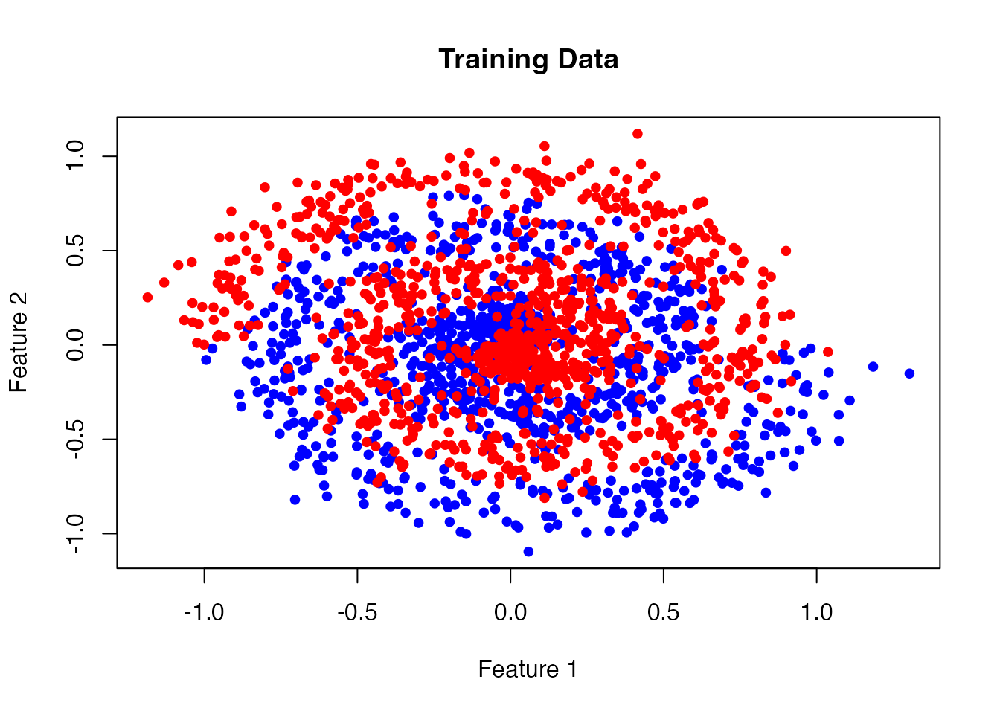
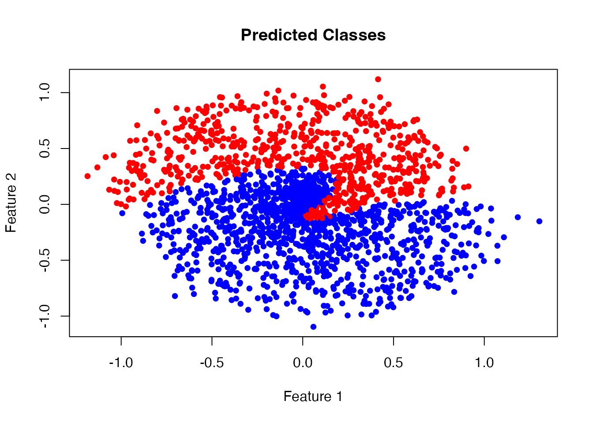

# Neural Networks with Rmlx

This vignette demonstrates how to build and train neural networks using
Rmlx’s neural network layers and automatic differentiation capabilities.

## Building a Neural Network

Rmlx provides modular neural network components that can be combined
using
[`mlx_sequential()`](https://hughjonesd.github.io/Rmlx/reference/mlx_sequential.md).
Here’s a simple multi-layer perceptron (MLP) for binary classification:

``` r
library(Rmlx)
#> 
#> Attaching package: 'Rmlx'
#> The following object is masked from 'package:stats':
#> 
#>     fft
#> The following objects are masked from 'package:base':
#> 
#>     asplit, backsolve, chol2inv, col, colMeans, colSums, diag, drop,
#>     outer, row, rowMeans, rowSums, svd

# Create a 3-layer MLP
mlp <- mlx_sequential(
  mlx_linear(2, 32),    # Input: 2 features
  mlx_relu(),
  mlx_dropout(p = 0.2),
  mlx_linear(32, 16),
  mlx_relu(),
  mlx_linear(16, 1),    # Output: 1 logit
  mlx_sigmoid()         # Probability output
)
```

## Generating Training Data

Let’s create a simple binary classification dataset:

``` r
set.seed(42)

# Generate spiral dataset
n_samples <- 2000
noise <- 0.1

# Class 0: first spiral starting at angle 0
theta0 <- runif(n_samples/2, 0, 4*pi)
r0 <- theta0 / (4*pi) + rnorm(n_samples/2, 0, noise)
x0 <- cbind(r0 * cos(theta0), r0 * sin(theta0))
y0 <- rep(0, n_samples/2)

# Class 1: second spiral starting at angle pi (interleaved)
theta1 <- runif(n_samples/2, 0, 4*pi)
r1 <- theta1 / (4*pi) + rnorm(n_samples/2, 0, noise)
x1 <- cbind(r1 * cos(theta1 + pi), r1 * sin(theta1 + pi))
y1 <- rep(1, n_samples/2)

# Combine
x_train <- rbind(x0, x1)
y_train <- c(y0, y1)

# Convert to MLX tensors
x_mlx <- as_mlx(x_train)
y_mlx <- as_mlx(matrix(y_train, ncol = 1))
```

``` r
# Visualize the training data
plot(x_train[, 1], x_train[, 2],
     col = ifelse(y_train == 0, "blue", "red"),
     pch = 19, cex = 0.8,
     main = "Training Data",
     xlab = "Feature 1", ylab = "Feature 2")
```



## Training Loop

Define a loss function and train using gradient descent:

``` r
# Loss function operating on the module
loss_fn <- function(module, x, y) {
  preds <- mlx_forward(module, x)
  mlx_binary_cross_entropy(preds, y)
}

# Training parameters
learning_rate <- 0.05
n_epochs <- 600

# Optimizer and training mode
optimizer <- mlx_optimizer_sgd(mlx_parameters(mlp), lr = learning_rate)
mlx_set_training(mlp, TRUE)

for (epoch in seq_len(n_epochs)) {
  step <- mlx_train_step(mlp, loss_fn, optimizer, x_mlx, y_mlx)

  if (epoch %% 100 == 0) {
    loss_value <- as.numeric(as.matrix(step$loss))
    cat(sprintf("Epoch %d, Loss: %.4f\n", epoch, loss_value))
  }
}
#> Epoch 100, Loss: 0.6695
#> Epoch 200, Loss: 0.6613
#> Epoch 300, Loss: 0.6625
#> Epoch 400, Loss: 0.6569
#> Epoch 500, Loss: 0.6599
#> Epoch 600, Loss: 0.6533

mlx_set_training(mlp, FALSE)
```

## Evaluating Model Performance

Let’s evaluate the model’s predictions:

``` r
# Make predictions on all training points
predictions <- mlx_forward(mlp, x_mlx)
pred_probs <- as.matrix(predictions)
pred_classes <- ifelse(pred_probs > 0.5, 1, 0)

# Confusion matrix
confusion <- table(Actual = y_train, Predicted = pred_classes)
print(confusion)
#>       Predicted
#> Actual   0   1
#>      0 771 229
#>      1 541 459

# Calculate accuracy
accuracy <- sum(diag(confusion)) / sum(confusion)
cat(sprintf("\nAccuracy: %.2f%%\n", accuracy * 100))
#> 
#> Accuracy: 61.50%
```

``` r
# Plot predicted classes
plot(x_train[, 1], x_train[, 2],
     col = ifelse(pred_classes == 0, "blue", "red"),
     pch = 19, cex = 0.8,
     main = "Predicted Classes",
     xlab = "Feature 1", ylab = "Feature 2")
```



## Using Different Architectures

Rmlx provides various layer types for different architectures:

### Convolutional Features

While full convolution layers require C++ implementation, you can
combine linear layers with reshape operations:

``` r
# Classifier with normalization
classifier <- mlx_sequential(
  mlx_linear(10, 64),
  mlx_layer_norm(64),
  mlx_relu(),
  mlx_dropout(p = 0.5),
  mlx_linear(64, 32),
  mlx_batch_norm(32),
  mlx_relu(),
  mlx_linear(32, 3),
  mlx_softmax_layer()  # Multi-class output
)
```

### Embeddings for Categorical Data

Use
[`mlx_embedding()`](https://hughjonesd.github.io/Rmlx/reference/mlx_embedding.md)
for categorical inputs:

``` r
# Text/token embeddings
vocab_size <- 10000
embed_dim <- 128

embedding_net <- mlx_sequential(
  mlx_embedding(vocab_size, embed_dim),
  mlx_linear(embed_dim, 64),
  mlx_relu(),
  mlx_linear(64, 1)
)

# Input: token indices (0-indexed)
tokens <- as_mlx(c(42, 17, 99))
output <- mlx_forward(embedding_net, tokens)
```

## Available Loss Functions

Rmlx implements common loss functions:

- [`mlx_mse_loss()`](https://hughjonesd.github.io/Rmlx/reference/mlx_mse_loss.md):
  Mean squared error (regression)
- [`mlx_l1_loss()`](https://hughjonesd.github.io/Rmlx/reference/mlx_l1_loss.md):
  Mean absolute error (robust regression)
- [`mlx_binary_cross_entropy()`](https://hughjonesd.github.io/Rmlx/reference/mlx_binary_cross_entropy.md):
  Binary classification
- [`mlx_cross_entropy()`](https://hughjonesd.github.io/Rmlx/reference/mlx_cross_entropy.md):
  Multi-class classification

Each supports `reduction = "mean"`, `"sum"`, or `"none"`.

## Available Activation Functions

- [`mlx_relu()`](https://hughjonesd.github.io/Rmlx/reference/mlx_relu.md):
  Rectified Linear Unit
- [`mlx_gelu()`](https://hughjonesd.github.io/Rmlx/reference/mlx_gelu.md):
  Gaussian Error Linear Unit
- [`mlx_sigmoid()`](https://hughjonesd.github.io/Rmlx/reference/mlx_sigmoid.md):
  Logistic sigmoid
- [`mlx_tanh()`](https://hughjonesd.github.io/Rmlx/reference/mlx_tanh.md):
  Hyperbolic tangent
- [`mlx_silu()`](https://hughjonesd.github.io/Rmlx/reference/mlx_silu.md):
  Sigmoid Linear Unit (Swish)
- [`mlx_leaky_relu()`](https://hughjonesd.github.io/Rmlx/reference/mlx_leaky_relu.md):
  Leaky ReLU with configurable slope
- [`mlx_softmax_layer()`](https://hughjonesd.github.io/Rmlx/reference/mlx_softmax_layer.md):
  Softmax normalization

## Regularization and Normalization

- [`mlx_dropout()`](https://hughjonesd.github.io/Rmlx/reference/mlx_dropout.md):
  Dropout regularization
- [`mlx_layer_norm()`](https://hughjonesd.github.io/Rmlx/reference/mlx_layer_norm.md):
  Layer normalization
- [`mlx_batch_norm()`](https://hughjonesd.github.io/Rmlx/reference/mlx_batch_norm.md):
  Batch normalization

Remember to set training mode appropriately:

``` r
model <- mlx_sequential(
  mlx_linear(2, 4),
  mlx_dropout(0.5)
)

# Training
mlx_set_training(model, TRUE)

# Evaluation
mlx_set_training(model, FALSE)
```

## Best Practices

1.  **Always evaluate**: Call
    [`mlx_eval()`](https://hughjonesd.github.io/Rmlx/reference/mlx_eval.md)
    after parameter updates to trigger computation
2.  **Training mode**: Set models to training mode during training,
    evaluation mode during inference
3.  **Gradient computation**: Use `argnums` in
    [`mlx_grad()`](https://hughjonesd.github.io/Rmlx/reference/mlx_grad.md)
    to specify which arguments to differentiate
4.  **Device management**: Ensure all tensors are on the same device
    (GPU/CPU)

## Further Reading

- See
  [`vignette("linear-regression")`](https://hughjonesd.github.io/Rmlx/articles/linear-regression.md)
  for a simpler optimization example
- Check
  [`?mlx_grad`](https://hughjonesd.github.io/Rmlx/reference/mlx_grad.md)
  for automatic differentiation details
- Refer to the [MLX Python
  documentation](https://ml-explore.github.io/mlx/build/html/python/nn.html)
  for more advanced patterns
